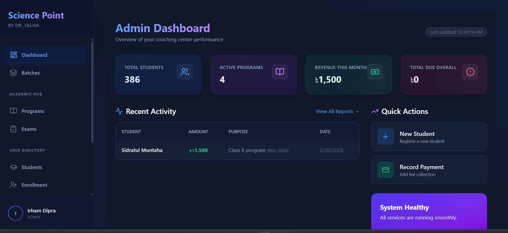
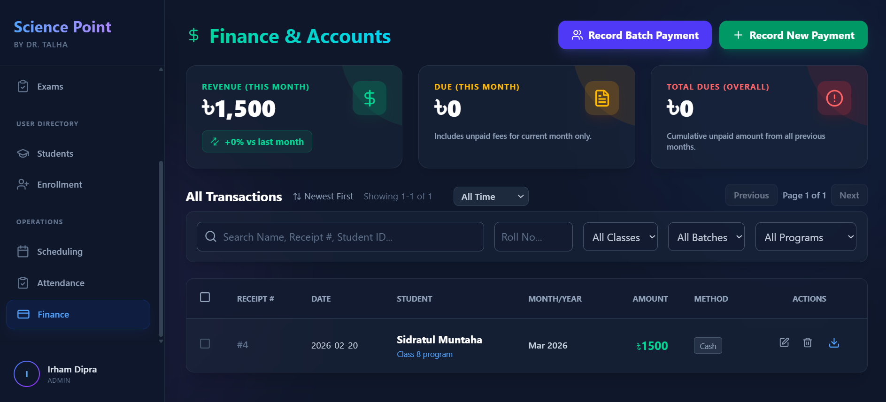

# 🎓 Coaching Management System

[](https://fastapi.tiangolo.com/)
[](https://react.dev/)
[](https://supabase.com/)
[](https://render.com/)
[](https://vercel.com/)
[](https://opensource.org/licenses/MIT)

A full-stack, production-grade web application for managing student enrollments, fee payments, attendance tracking, and academic performance in a coaching institute or tutoring center environment.

---

## 📸 Screenshots

| Dashboard | Finance | Student Profile |
|-----------|---------|-----------------|
|  |  |  |

---

## ✨ Feature Highlights

- **📋 Student & Batch Management** — Register students, organise by batch and class, print ID cards
- **📦 Program & Enrollment Management** — Create programs, enroll students in bulk, soft-delete programs without losing history
- **💳 Payment Processing** — Record single or bulk payments, prevent overpayment, maintain full ledger history per student
- **🧾 PDF Receipt & Report Generation** — Print payment receipts, mark sheets, and attendance reports as PDFs
- **📊 Finance Dashboard** — Live stats for total revenue, monthly income, total dues (overall & per month)
- **📅 Due Breakdown** — Per-student, per-program monthly due breakdown with arrears calculation
- **📝 Exam Management** — Create exams, upload results in bulk (CSV/Excel), view performance analytics
- **📆 Attendance Tracking** — Mark attendance per enrollment and view attendance trends per student
- **🔐 Role-Based Access Control** — Supabase Auth with admin-only access enforcement
- **🔍 Dynamic Pagination & Search** — Server-side paginated tables with search, filter, and sort

---

## 🛠️ Tech Stack

### Frontend
| Technology | Purpose |
|---|---|
| **React 18** | UI framework |
| **Vite** | Fast development build tool |
| **Tailwind CSS** | Utility-first styling |
| **React Query** (`@tanstack/react-query`) | Server-state management & data caching |
| **React Router DOM** | Client-side routing |
| **Lucide React** | Icon library |
| **jsPDF** | Client-side PDF generation |
| **Supabase JS** | Auth & realtime client |

### Backend
| Technology | Purpose |
|---|---|
| **FastAPI** | High-performance Python REST API |
| **Uvicorn / Gunicorn** | ASGI server |
| **Supabase Python Client** | Database connectivity |
| **Pydantic v2** | Data validation & schemas |
| **python-dotenv** | Environment variable management |

### Database & Infrastructure
| Technology | Purpose |
|---|---|
| **Supabase** (PostgreSQL) | Hosted relational database + Auth |
| **Vercel** | Frontend hosting & CDN |
| **Render** | Backend hosting |

---

## 📁 Project Structure

```
Moniem-Project/
├── frontend/                  # React + Vite application
│   ├── public/
│   ├── src/
│   │   ├── components/        # Reusable UI components (Layout, Sidebar, Modals)
│   │   ├── pages/             # Route-level page components
│   │   ├── repositories/      # API call abstraction layer (TypeScript)
│   │   ├── utils/             # PDF generation, helpers
│   │   └── supabaseClient.ts  # Supabase client initialisation
│   ├── index.html
│   ├── vite.config.ts
│   └── package.json
│
├── backend/                   # FastAPI application
│   ├── app/
│   │   ├── core/              # Supabase client, config
│   │   ├── repositories/      # Database query logic (Python)
│   │   ├── routes/            # FastAPI router endpoints
│   │   └── schemas/           # Pydantic models
│   ├── main.py                # App entrypoint, CORS setup
│   ├── requirements.txt
│   └── .env                   # Environment variables (not committed)
│
├── current_database.sql       # Database schema snapshot
├── render.yaml                # Render deployment config
└── README.md
```

---

## 🗄️ Database Schema Overview

The system uses a **PostgreSQL** database hosted on Supabase with the following core tables:

| Table | Description |
|---|---|
| `users` | Admin user profiles linked to Supabase Auth (`auth_id`) |
| `roles` | Role definitions (e.g., admin, viewer) |
| `student` | Student personal details, batch/class assignment. Supports soft-delete via `is_active` |
| `batch` | Batch/year groupings for students |
| `program` | Course/program definitions with fee and duration. Supports soft-delete |
| `enrollment` | Links students to programs with roll number and status (`Active`/`Withdrawn`) |
| `payment` | Individual payment records linked to an enrollment, month, and year |
| `exam` | Exam metadata (name, date, total marks) linked to a program |
| `student_individual_result` | Per-student results per exam |
| `attendance` | Daily attendance records linked to enrollments |
| `room_schedule` | Room/class scheduling data |

---

## 🚀 Local Setup & Installation

### Prerequisites
- **Node.js** (v18+)
- **Python** (v3.10+)
- A **Supabase** project with the schema applied

### 1. Clone the Repository

```bash
git clone https://github.com/your-username/coaching-management-system.git
cd coaching-management-system
```

### 2. Backend Setup

```bash
cd backend

# Create and activate virtual environment
python -m venv venv
venv\Scripts\activate        # Windows
# source venv/bin/activate   # macOS/Linux

# Install dependencies
pip install -r requirements.txt

# Create your .env file
cp .env.example .env
# Edit .env and add your Supabase credentials

# Start the development server
uvicorn main:app --reload --port 8000
```

### 3. Frontend Setup

```bash
cd frontend

# Install dependencies
npm install

# Create your environment file
cp .env.example .env
# Edit .env and add your Supabase + API URL

# Start the development server
npm run dev
```

### 4. Environment Variables

**`backend/.env.example`**
```env
SUPABASE_URL=https://your-project-id.supabase.co
SUPABASE_KEY=your-supabase-service-role-key
```

**`frontend/.env.example`**
```env
VITE_SUPABASE_URL=https://your-project-id.supabase.co
VITE_SUPABASE_ANON_KEY=your-supabase-anon-key
VITE_API_URL=http://localhost:8000
```

---

## 🌐 API Overview

The backend exposes a RESTful API built with **FastAPI**. Key route groups:

| Prefix | Description |
|---|---|
| `/students` | Student CRUD, analytics, financial summary |
| `/students/{id}/enrollments` | Enrollment management per student |
| `/programs` | Program CRUD, soft-delete, analytics |
| `/batches` | Batch management |
| `/payments` | Bulk payment, update, delete, paginated list |
| `/finance/stats` | Dashboard KPI stats |
| `/finance/due-breakdown` | Lifetime due breakdown |
| `/finance/due-breakdown/monthly` | Monthly due breakdown |
| `/exams` | Exam management and result upload |
| `/attendance` | Attendance marking and reporting |

CORS is configured in `main.py` to allow requests from the deployed frontend and `localhost`.

---

## 📄 License

This project is licensed under the **MIT License**.

```
MIT License

Copyright (c) 2026

Permission is hereby granted, free of charge, to any person obtaining a copy
of this software and associated documentation files (the "Software"), to deal
in the Software without restriction, including without limitation the rights
to use, copy, modify, merge, publish, distribute, sublicense, and/or sell
copies of the Software, and to permit persons to whom the Software is
furnished to do so, subject to the following conditions:

The above copyright notice and this permission notice shall be included in all
copies or substantial portions of the Software.

THE SOFTWARE IS PROVIDED "AS IS", WITHOUT WARRANTY OF ANY KIND, EXPRESS OR
IMPLIED, INCLUDING BUT NOT LIMITED TO THE WARRANTIES OF MERCHANTABILITY,
FITNESS FOR A PARTICULAR PURPOSE AND NONINFRINGEMENT. IN NO EVENT SHALL THE
AUTHORS OR COPYRIGHT HOLDERS BE LIABLE FOR ANY CLAIM, DAMAGES OR OTHER
LIABILITY, WHETHER IN AN ACTION OF CONTRACT, TORT OR OTHERWISE, ARISING FROM,
OUT OF OR IN CONNECTION WITH THE SOFTWARE OR THE USE OR OTHER DEALINGS IN THE
SOFTWARE.
```
